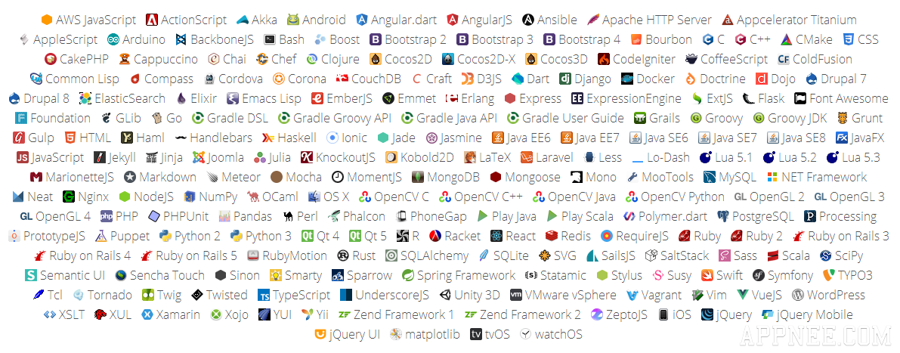

# Welcome to Advent of code 2018 - The many languages challange!



Link: https://adventofcode.com/2018

In this repo we try to solve the daily tasks in as many languages as possible. Pick a language which does not have a solution yet and solve it.


### Solution matrix

 | Language   | 01 | 02 | 03 | 04 | 05 | 06 | 07 | 08 | 09 | 10 | 11 | 12 | 13 | 14 | 15 | 16 | 17 | 18 | 19 | 20 | 21 | 22 | 23 | 24 | 25 |
 |------------|----|----|----|----|----|----|----|----|----|----|----|----|----|----|----|----|----|----|----|----|----|----|----|----|----|
 | Golang     | x  |    |    |    |    |    |    |    |    |    |    |    |    |    |    |    |    |    |    |    |    |    |    |    |    |
 | Bash     | x  |    |    |    |    |    |    |    |    |    |    |    |    |    |    |    |    |    |    |    |    |    |    |    |    |

### General
* There are no deadlines (You don't have to submit day01 on 01. desember 2018)
* You may look at other's solutions, or you can do it on your own. Pick your challange.

### Contributing
* To contribute make a pull request with your solution.
* Name your pull-request like this example 'day03-golang'
* Fork repo or ask to join as contributor
* Every solution-file is named 'main' (e.g main.py, main.go, main.ru, main.js, main.cs, ....)

**Input**

Every folder contains a `input`-file. Expand the data of this file to program arguments using the unix `cat` command.
```
$ go run main.go $(cat input)
```
...expands to
```
$ go run main.go +10 -3 -17 +4 +23 +16 -7 -30 +29 -19 +18 -3 ...
```

**Output**

 `part1` or `part2` followed by a space and your answer.
```
$ go run main.go $(cat input)
part1 408
part2 55250
```

